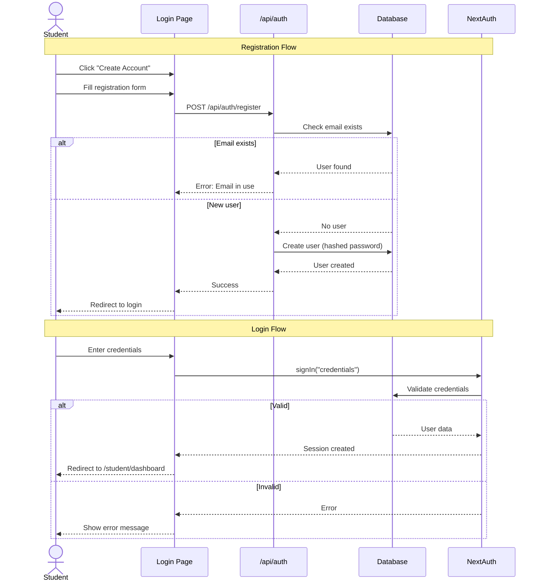
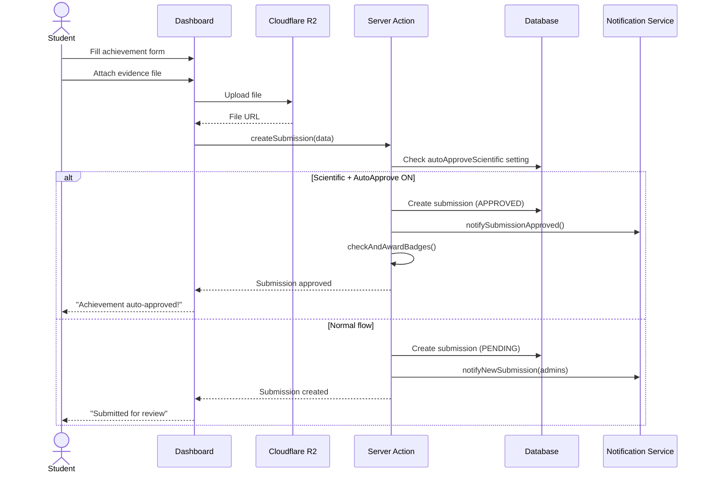
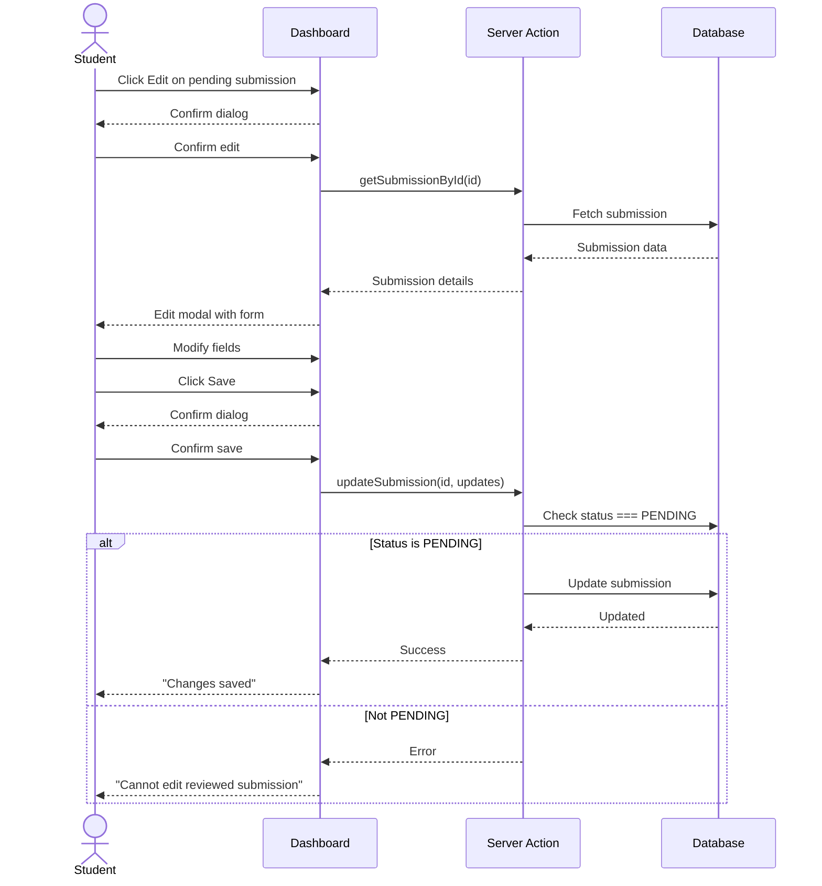
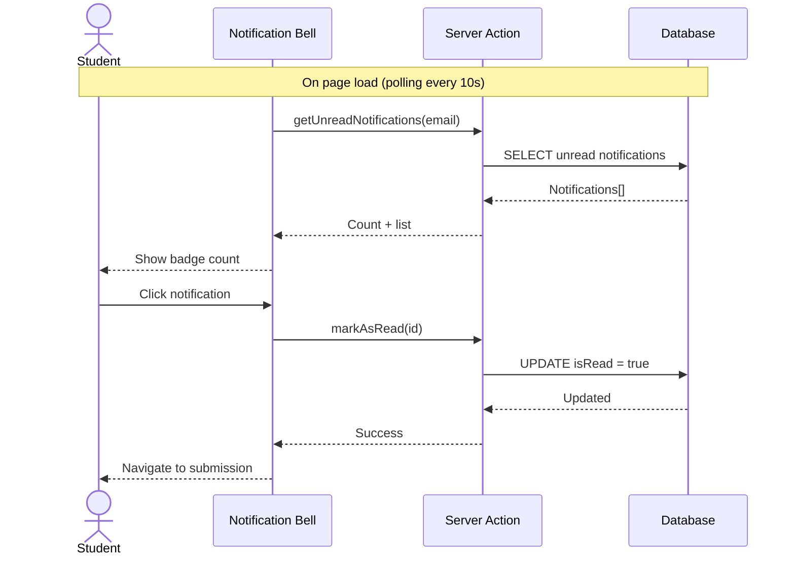
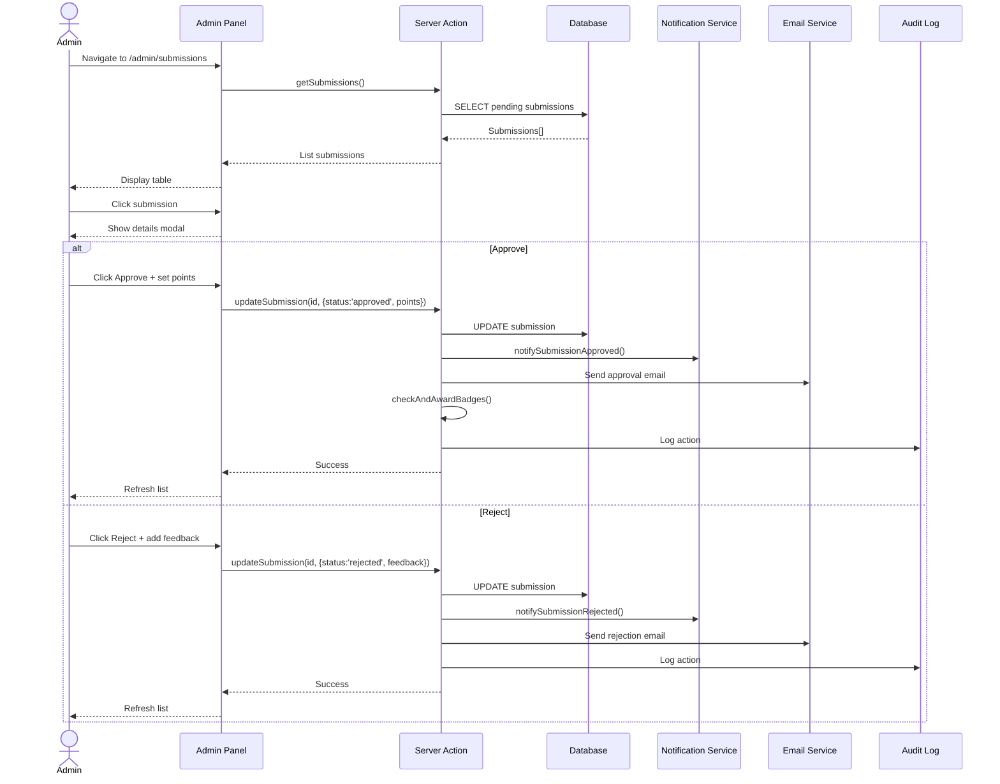
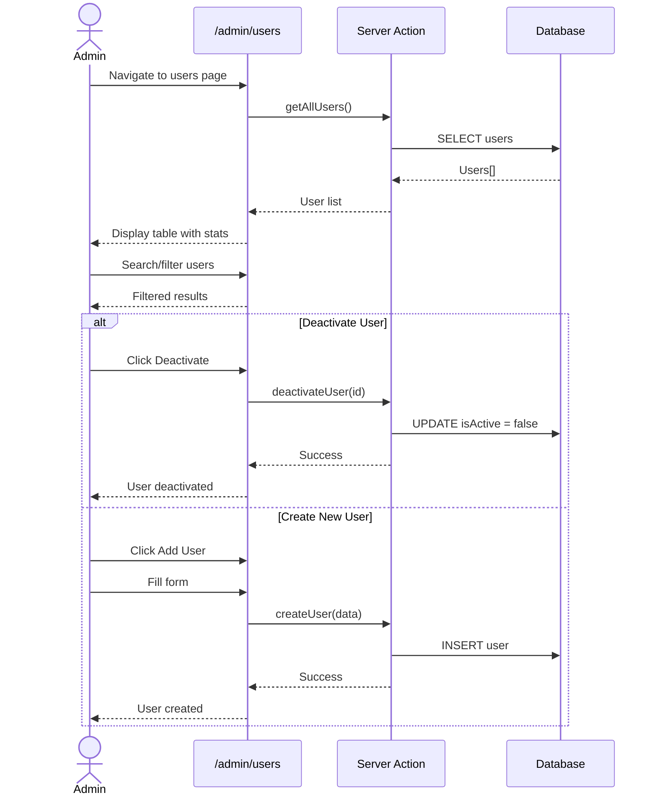
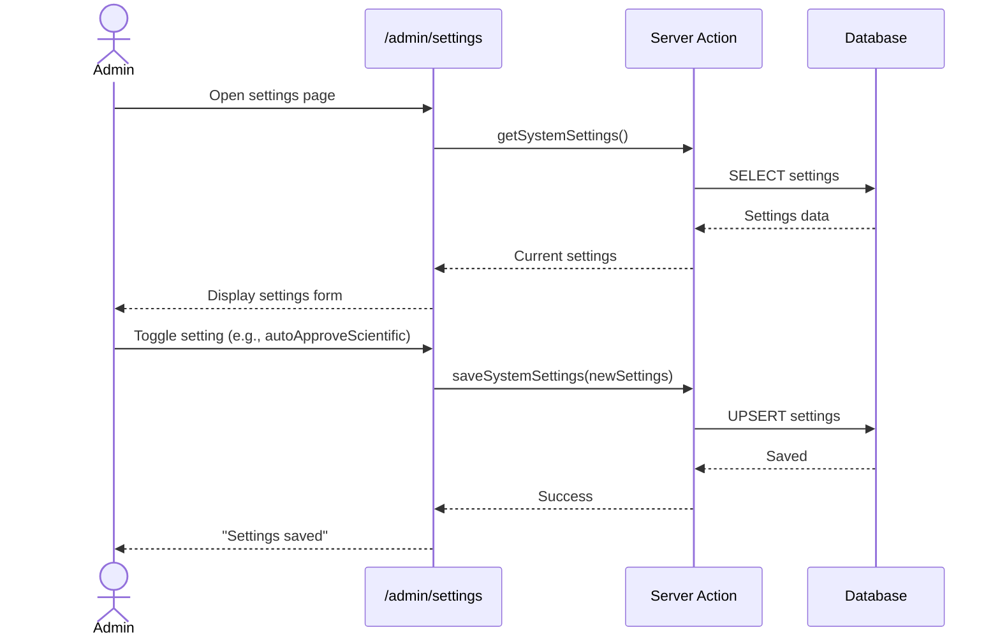
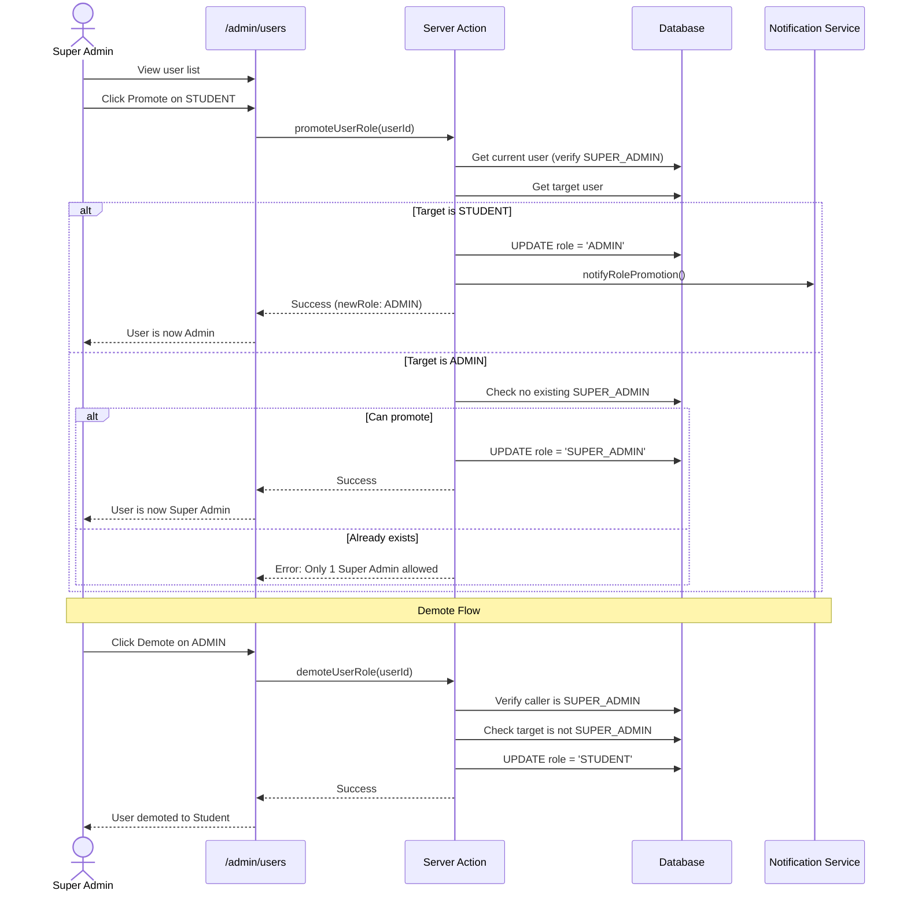
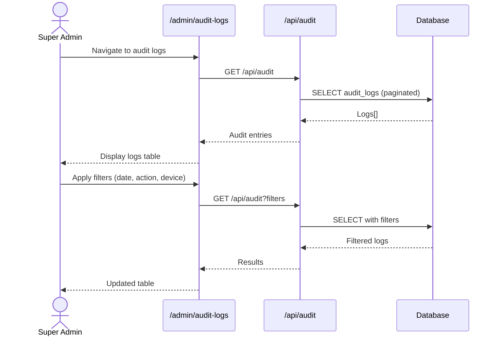
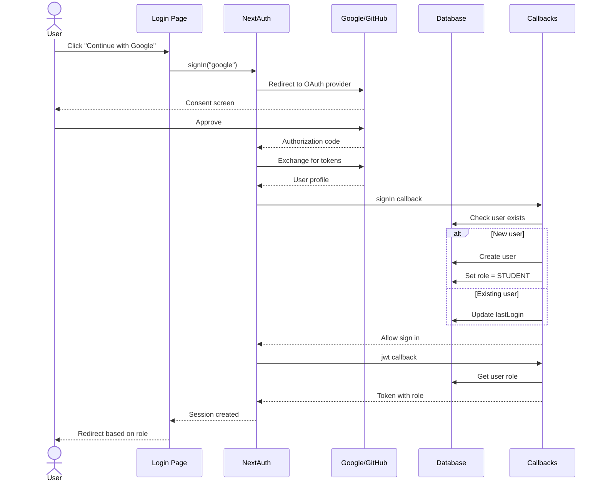

# System Sequence Diagrams

This document contains Mermaid sequence diagrams for all user roles and functions.

---

## Student Role

### 1. Registration & Login Flow

### 2. Submit Achievement Flow

### 3. Edit Pending Submission Flow

### 4. View Notifications Flow

---

## Admin Role

### 5. Review Submission Flow

### 6. Manage Users Flow

### 7. System Settings Flow

---

## Super Admin Role

### 8. Promote/Demote User Flow

### 9. View Audit Logs Flow

---

## Cross-Role: Authentication Flow

### 10. OAuth Login Flow

---

## Legend

| Symbol | Meaning |
|--------|---------|
| `actor` | User/Role |
| `participant` | System component |
| `->>`  | Request/Action |
| `-->>` | Response |
| `alt/else` | Conditional branch |
| `Note over` | Explanation |
